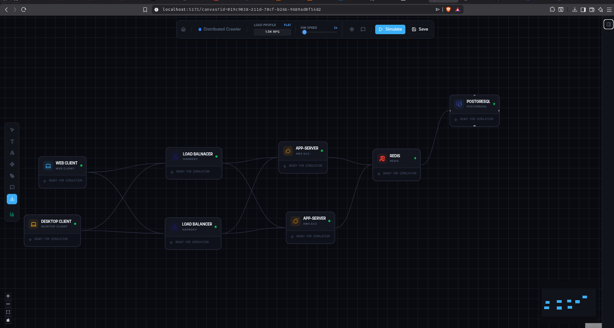
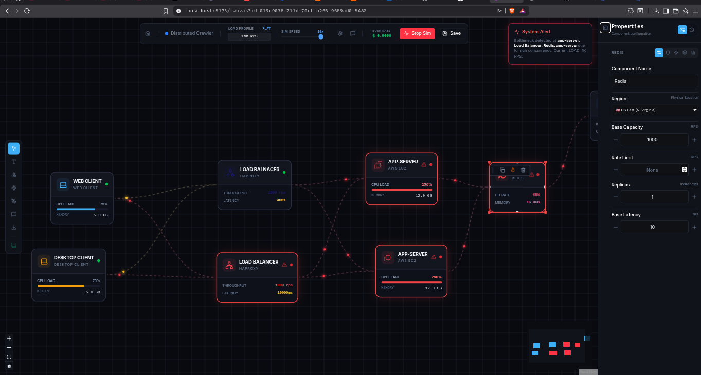
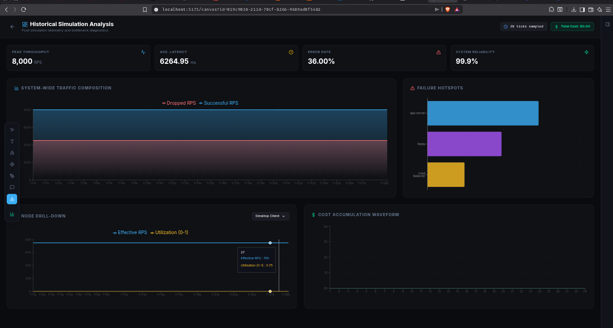
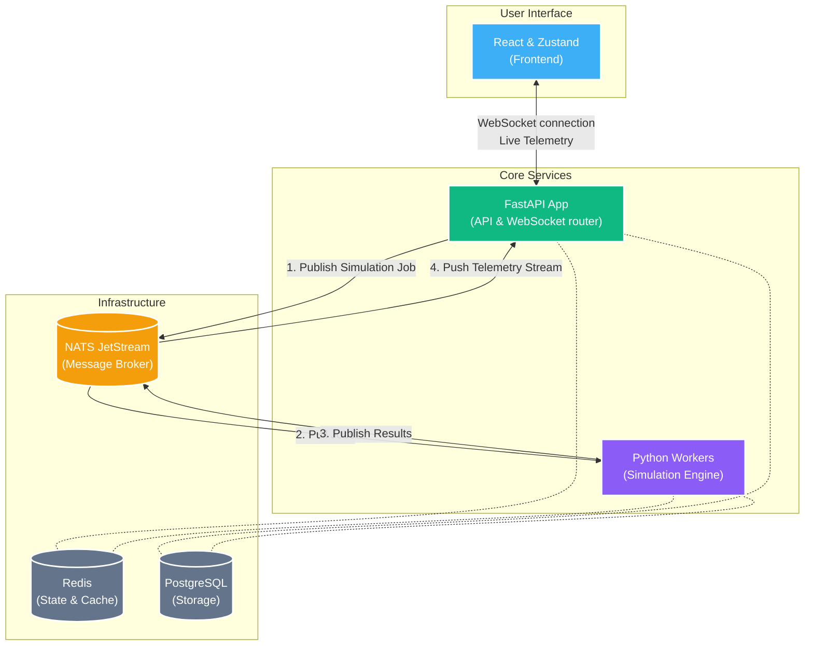

<div align="center">
  
  <h1>Primer: High-Performance Architecture Simulator</h1>
  <p><strong>Visually Design, Test, and Break Distributed Systems Before You Build Them.</strong></p>
</div>

<br />



## What is Primer?

Primer is an interactive, browser-based simulation tool that allows software engineers, architects, and technical leaders to design complex cloud architectures and simulate how they will perform under massive user traffic. 

Instead of writing thousands of lines of code just to discover your database will crash under an unexpected spike in visitors, Primer lets you **drag-and-drop** components (like Load Balancers, Databases, and API Servers) onto a canvas, connect them, and run real-time stress tests. It acts like a "flight simulator" for backend infrastructure, helping teams visualize bottlenecks, identify points of failure, and calculate estimated cloud costs before a single dollar is spent on real servers.

---

## Key Features

*   **Interactive Architecture Canvas:** A rich, responsive drag-and-drop interface to build complex systems.
*   **Real-time Traffic Simulation:** Push simulated traffic (up to hundreds of thousands of requests per second) through your imaginary system and watch it react instantly.
*   **Chaos Engineering:** Introduce random network failures, server crashes, and latency jitter to see if your system can survive the unexpected.
*   **Cost Estimation (Burn Rate):** Automatically calculates how much your infrastructure will cost in real life based on how much traffic you throw at it.
*   **Deep Analytics Dashboard:** A comprehensive breakdown of your system's performance, highlighting exactly which component caused a traffic jam.
*   **One-Click Export:** Instantly download high-quality PDFs, PNGs, SVGs, or animated GIFs of your architecture to share with stakeholders.



---

## 🎬 See Primer in Action

https://github.com/user-attachments/assets/91e2f52b-41dd-4525-9c45-adfc987c1026

---

## How the Simulation Engine Works

Primer uses a sophisticated discrete-event simulation engine to model how data flows through your system. Think of it as a virtual laboratory where you can stress-test your architecture without spending a dime on real servers.

### 1. Traffic Generation: The "Traffic Pattern"
Every simulation starts with a **Traffic Pattern**. This defines how many users are hitting your system:
*   **Base RPS (Normal Load):** The steady number of requests per second your system usually handles.
*   **Peak RPS (Burst Load):** A sudden surge in traffic (e.g., a Black Friday sale or a viral post).
*   **Duration:** How long the burst of traffic lasts before returning to normal.
*   **Pattern Curves:** You can choose between **Static** (flat line), **Spike** (sudden up and down), or **Step** (permanent increase) patterns.

### 2. How Components Handle Traffic
When traffic hits a component (like an API or a Database), the engine calculates three main things:

#### **A. Capacity & Utilization (The "Busyness")**
Each component has a **Base Capacity** (how many requests a single instance can handle). 
*   **Calculation:** `Total Capacity = Base Capacity × Number of Replicas`.
*   **Utilization:** If you have 1,000 requests hitting a system that can handle 2,000, your utilization is **50%**. If traffic exceeds 100%, the component is saturated, and requests start getting "dropped" (failing).

#### **B. Latency (The "Wait Time")**
Requests don't just happen instantly; they take time. 
*   **Base Latency:** The minimum time a request takes when the system is empty (e.g., 50ms).
*   **The "Traffic Jam" Effect:** As a component gets busier, it slows down. We use mathematical models (Queuing Theory) to simulate how requests wait in line. Once utilization hits 90%+, latency spikes exponentially—just like a real-world server struggling to keep up.

#### **C. Component-Specific Logic**
*   **Compute (APIs/Workers):** Standard processing nodes that scale horizontally.
*   **Caches (Redis/Memcached):** These use **Hit Rates**. If your hit rate is 80%, 80% of requests are handled instantly by the cache, and only 20% put load on your slower database.
*   **Databases:** We model **Read Replicas** to spread the load and **Replication Lag** to simulate the delay between data being written and becoming available to read.
*   **Queues (Kafka/SQS):** Act as buffers. If traffic spikes, the queue "absorbs" the blow by storing requests in a buffer. However, if the **Queue Size** limit is reached, it will overflow and start dropping data.

### 3. Resilience & Chaos
*   **Auto-scaling:** The system monitors utilization. If a component is "too busy" for too long, it automatically adds more **Replicas** (spawns more virtual servers) to handle the load.
*   **Service Mesh (Retries & Timeouts):** 
    - **Retries:** If a request fails, the system can try again.
    - **Timeout:** If a request takes too long (e.g., >500ms), the system gives up to prevent a total lockup.
    - **Retry Budget:** Prevents "Retry Storms" where failing systems are overwhelmed by millions of repeated requests.
*   **Multi-Region Delays:** If traffic travels from a user in Asia to a server in the US, the engine automatically adds real-world fiber-optic delay (Latency Matrix).
*   **Chaos Engineering:** You can inject **Packet Loss** (randomly failing connections) and **Jitter** (unstable connection speeds) to see if your architecture is truly robust.

---

### Handling Heavy Computation
Calculating millions of virtual requests across dozens of connected components in real-time requires serious horsepower. This is solved by creating a **distributed worker pool**. Instead of one worker trying to do everything, Primer delegates the heavy math to multiple "Worker" programs running in the background.



### The Tech Stack

*   **Backend:** FastAPI, Python, NATS JetStream
*   **Database:** PostgreSQL, Redis
*   **Frontend:** React, ReactFlow, Zustand

---

## Architecture Design

### High-Level Event Flow

Primer is architected as an event-driven, decoupled system to keep the user interface lightning fast even during massive recalculations.



### Understanding Our Infrastructure

Why split the application apart? When you click "Start Simulation", we can't afford to block the `FastAPI` web server from handling other user requests while it calculates mathematics for the next 10 seconds. We break the tasks down using dedicated tools:

*   **API Server (FastAPI):** The entry point. It receives HTTP requests for CRUD operations (saving architecture designs) and holds open WebSocket connections to stream live charts back to the browser.
*   **Command Broker (NATS JetStream):** 
    - The API Router immediately pushes your heavy simulation job onto a NATS queue.
    - NATS acts as a buffer. It securely holds the jobs until a background worker is ready. 
    - This decouples the API server from the computational engine, ensuring identical web throughput regardless of how massive your simulation is.
*   **Simulation Engine (Python Workers):**
    - Headless background workers listen to NATS queues constantly. 
    - They pull jobs, execute the Topological Sort to calculate component capacity, routing flow, and latency per tick. 
    - Once finished, they publish the mathematical results back to a reply queue in NATS, which the API Server instantly reads and forwards to your browser.
*   **State & Persistence:**
    - **Redis:** Manages extremely fast, ephemeral data. We use it to store active WebSocket connection states and session locks so workers and the API know who is doing what.
    - **Postgres:** The reliable vault. It permanently stores system designs, component topologies, and historic run metrics using atomic operations to guarantee data integrity across multiple architectural runs.

### Modular Architecture Execution

This system is engineered using a robust **Modular** pattern to ensure responsibilities stay separated:

1.  **The User Builds:** You design a system on the frontend.
2.  **The WebSocket Streams:** A continuous connection is opened between the browser and the FastAPI server.
3.  **The Engine Computes:** The worker reads from NATS, calculates metrics, applies retry logic, and determines failure cascades.
4.  **Live Updates:** Results are handed back through the Message Broker instantly, painting realistic traffic animations on the screen.
5.  **Post-Analysis:** Background routines save the finalized run data into Postgres for deep-dive historical review.

---

## Getting Started (Local Development)

Docker is used to make getting started as simple as possible.

### Prerequisites
*   Docker & Docker Compose
*   Node.js (for frontend tooling)
*   Python (uv package manager recommended)

### One-Command Setup

```bash
# Clone the repository
git clone https://github.com/lupppig/primer.git
cd primer

# Spin up the entire infrastructure (DB, NATS, Redis, MinIO)
cd server
docker-compose up -d

# Install backend dependencies and run
uv sync
uv run uvicorn app.main:app --reload

# In a separate terminal, start the frontend
cd web
npm install
npm run dev
```

Visit `http://localhost:5173` to start simulating!
