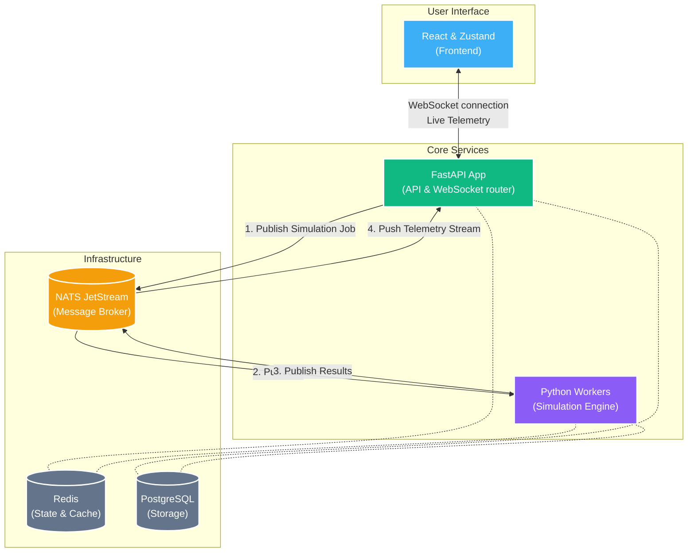

<div align="center">
  
  <h1>Primer: High-Performance Architecture Simulator</h1>
  <p><strong>Visually Design, Test, and Break Distributed Systems Before You Build Them.</strong></p>
</div>

<br />


## What is Primer?

Primer is an interactive, browser-based simulation tool that allows software engineers, architects, and technical leaders to design complex cloud architectures and simulate how they will perform under massive user traffic. 

Instead of writing thousands of lines of code just to discover your database will crash under an unexpected spike in visitors, Primer lets you **drag-and-drop** components (like Load Balancers, Databases, and API Servers) onto a canvas, connect them, and run real-time stress tests. It acts like a "flight simulator" for backend infrastructure, helping teams visualize bottlenecks, identify points of failure, and calculate estimated cloud costs before a single dollar is spent on real servers.

---

## Key Features

*   **Interactive Architecture Canvas:** A rich, responsive drag-and-drop interface to build complex systems.
*   **Real-time Traffic Simulation:** Push simulated traffic (up to hundreds of thousands of requests per second) through your imaginary system and watch it react instantly.
*   **Chaos Engineering:** Introduce random network failures, server crashes, and latency jitter to see if your system can survive the unexpected.
*   **Cost Estimation (Burn Rate):** Automatically calculates how much your infrastructure will cost in real life based on how much traffic you throw at it.
*   **Deep Analytics Dashboard:** A comprehensive breakdown of your system's performance, highlighting exactly which component caused a traffic jam.
*   **One-Click Export:** Instantly download high-quality PDFs, PNGs, SVGs, or animated GIFs of your architecture to share with stakeholders.


---

## How It Works Under the Hood

Primer handles an immense amount of mathematical computation without freezing the browser. To achieve this, the application is split into two distinct halves: a blazing-fast Frontend for visualization and a heavy-duty Backend cluster for raw calculation.

### The Mathematics of Simulation
When you click "Start Simulation," Primer isn't just drawing animations. The application executes a sophisticated performance model based on Little's Law and queuing theory.

The Engine relies on a **Topological Sort** algorithm to determine the critical path of the network (e.g., Load Balancer $\rightarrow$ Web Server $\rightarrow$ Database). In a single virtual "tick" (1 second), the engine passes numbers representing active incoming HTTPS requests from parent to child components based on connection weights.

Every component then performs four critical calculations:
1.  **Effective Flow vs. Drop Rate:** If incoming requests exceed a node's *Capacity Limit*, it fulfills what it can. The overflow is logged as dropped requests, acting as an instant visualization of a cascading system failure.
2.  **Latency:** Calculated dynamically as `Base Latency + Queuing Delay`. As utilization approaches 100%, the queuing delay spikes exponentially, simulating the "traffic jam" effect of overloaded CPU threads.
3.  **Dynamic Scaling:** If configured, nodes will check their utilization limits and spawn (or terminate) Replicas to absorb the shifting traffic.
4.  **Pricing (Burn Rate):** A cost function is run per component. It divides the node's fixed monthly hardware cost into seconds, and adds a variable usage cost based on the traffic it successfully processed. The dashboard sums this globally, providing a real-time "$/hr" burn rate indicator.

### Handling Heavy Computation
Calculating millions of virtual requests across dozens of connected components in real-time requires serious horsepower. This is solved by creating a **distributed worker pool**. Instead of one worker trying to do everything, Primer delegates the heavy math to multiple "Worker" programs running in the background.


### The Tech Stack

Carefully chose technologies that excel at speed, reliability, and real-time communication:

*   **FastAPI & Python (Backend):** Powers the core API and the complex mathematical simulation engine. Python is perfect for the heavy data processing required per tick.
*   **NATS JetStream (Message Broker):** The central nervous system of Primer. When the frontend asks to run a simulation, the API sends a message to NATS. NATS instantly routes this massive job to an available background Worker, ensuring the API itself never slows down or crashes.
*   **PostgreSQL (Database):** The reliable vault. It permanently stores your architecture designs, run histories, and analytical data with guarantees that nothing gets lost or overwritten (thanks to atomic database operations).
*   **Redis (In-Memory Data Store):** Used for lightning-fast caching and managing active user sessions. When data is needed *now*, Redis is the answer.
*   **React & Zustand (Frontend):** The canvas is built using ReactFlow for smooth, interactive diagramming. Zustand manages the incredibly complex "state" of the dashboard (keeping track of thousands of changing numbers per second) without causing the browser to stutter.

---

## Architecture Design

### High-Level Event Flow

Primer is architected as an event-driven, decoupled system to keep the user interface lightning fast even during massive recalculations.



### Understanding Our Infrastructure

Why split the application apart? When you click "Start Simulation", we can't afford to block the `FastAPI` web server from handling other user requests while it calculates mathematics for the next 10 seconds. We break the tasks down using dedicated tools:

*   **API Server (FastAPI):** The entry point. It receives HTTP requests for CRUD operations (saving architecture designs) and holds open WebSocket connections to stream live charts back to the browser.
*   **Command Broker (NATS JetStream):** 
    - The API Router immediately pushes your heavy simulation job onto a NATS queue.
    - NATS acts as a buffer. It securely holds the jobs until a background worker is ready. 
    - This decouples the API server from the computational engine, ensuring identical web throughput regardless of how massive your simulation is.
*   **Simulation Engine (Python Workers):**
    - Headless background workers listen to NATS queues constantly. 
    - They pull jobs, execute the Topological Sort to calculate component capacity, routing flow, and latency per tick. 
    - Once finished, they publish the mathematical results back to a reply queue in NATS, which the API Server instantly reads and forwards to your browser.
*   **State & Persistence:**
    - **Redis:** Manages extremely fast, ephemeral data. We use it to store active WebSocket connection states and session locks so workers and the API know who is doing what.
    - **Postgres:** The reliable vault. It permanently stores system designs, component topologies, and historic run metrics using atomic operations to guarantee data integrity across multiple architectural runs.

### Modular Architecture Execution

This system is engineered using a robust **Modular** pattern to ensure responsibilities stay separated:

1.  **The User Builds:** You design a system on the frontend.
2.  **The WebSocket Streams:** A continuous connection is opened between the browser and the FastAPI server.
3.  **The Engine Computes:** The worker reads from NATS, calculates metrics, applies retry logic, and determines failure cascades.
4.  **Live Updates:** Results are handed back through the Message Broker instantly, painting realistic traffic animations on the screen.
5.  **Post-Analysis:** Background routines save the finalized run data into Postgres for deep-dive historical review.

---

## Getting Started (Local Development)

Docker is used to make getting started as simple as possible.

### Prerequisites
*   Docker & Docker Compose
*   Node.js (for frontend tooling)
*   Python (uv package manager recommended)

### One-Command Setup

```bash
# Clone the repository
git clone https://github.com/lupppig/primer.git
cd primer

# Spin up the entire infrastructure (DB, NATS, Redis, MinIO)
cd server
docker-compose up -d

# Install backend dependencies and run
uv sync
uv run uvicorn app.main:app --reload

# In a separate terminal, start the frontend
cd web
npm install
npm run dev
```

Visit `http://localhost:5173` to start simulating!
